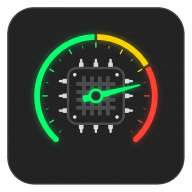
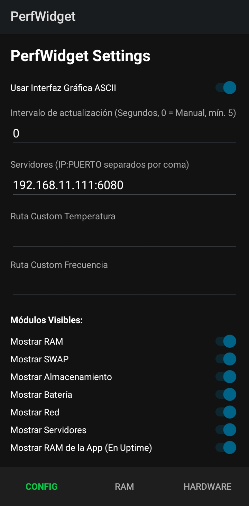
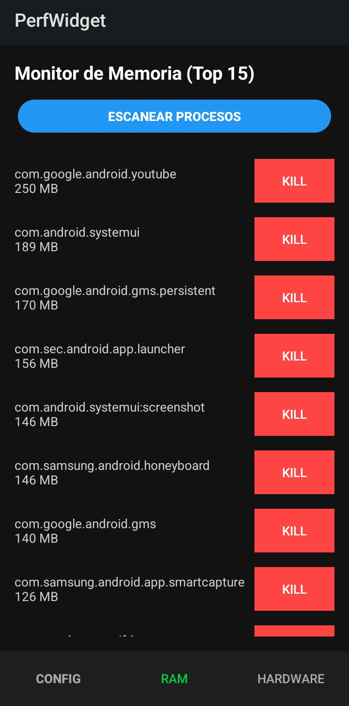
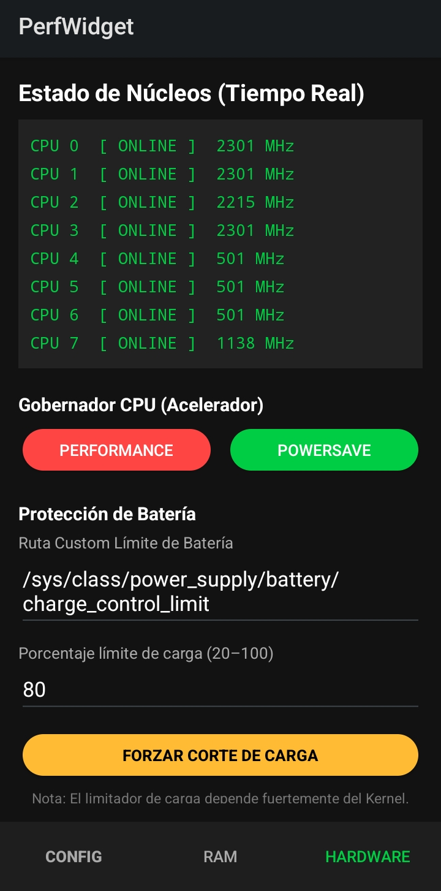

<div align="center">
  
  <h1>PerfWidget</h1>
  <p>Widget de monitoreo de sistema minimalista y de alto rendimiento para Android rooteado.</p>

  
  
  
  
  
</div>

---

PerfWidget lee métricas directamente desde el núcleo del sistema operativo (`/proc`, `/sys`) para ofrecer estadísticas precisas en tiempo real. Desarrollado como reto personal, demuestra cómo construir un monitor de recursos ligero aprovechando permisos de superusuario.

## Screenshots

<div align="center">
  
  
  
</div>

---

## Características

**Widget en pantalla de inicio**
- Uso de CPU en porcentaje, frecuencia del núcleo principal y temperatura del SoC
- Consumo de RAM y SWAP con indicadores de color según la carga
- Espacio de almacenamiento utilizado vs. total de la partición de datos
- Porcentaje y temperatura de batería en tiempo real
- Velocidad de red (descarga/subida) con escala dinámica (KB/s → MB/s)
- Uptime exacto desde el último reinicio
- Monitor de servidores propios vía ping TCP a IP:puerto configurables
- Pausa automática de actualizaciones cuando la pantalla está apagada

**App de configuración (3 pestañas)**

*Config* — Ajusta el intervalo de actualización, activa/desactiva métricas individualmente, configura rutas custom de temperatura y frecuencia, y gestiona la lista de servidores a monitorear.

*RAM* — Escanea los procesos activos en vivo ordenados por consumo de memoria, con opción de matar cualquier proceso individualmente con un toque.

*Hardware* — Monitor en tiempo real del estado y frecuencia de cada núcleo del CPU. Permite cambiar el gobernador del CPU (performance / powersave) y configurar un límite de carga de batería a nivel de kernel.

---

## Requisitos

- Android 12 (API 31) o superior
- Dispositivo rooteado (Magisk u otro)
- Launcher con soporte para widgets redimensionables

---

## Instalación

1. Descarga el APK desde [Releases](https://github.com/SaMeiers/PerfWidget/releases)
2. Instala el APK en tu dispositivo
3. Abre la app y concede permisos de **Superusuario** cuando se soliciten
4. Mantén presionada la pantalla de inicio → **Widgets** → busca **PerfWidget**
5. Arrástralo a tu pantalla — el servicio iniciará automáticamente

Para compilar desde el código fuente, abre el proyecto en Android Studio y ejecuta una build de release.

---

## Configuración de servidores

Desde la pestaña *Config* de la app, ingresa tus servidores en el campo correspondiente con el formato `IP:PUERTO`, uno por línea:

```
192.168.1.100:80
123.45.67.89:6080
```

El widget mostrará cada servidor con un indicador verde **(ON)** o rojo **(OFF)** según su disponibilidad.

---

## Compatibilidad de rutas de hardware

Debido a la fragmentación de Android, las rutas del kernel pueden variar según el fabricante y el procesador. PerfWidget detecta automáticamente la zona térmica del CPU, pero si alguna métrica muestra `N/A` puedes configurar rutas personalizadas desde la pestaña *Config*:

| Métrica | Ruta de ejemplo |
|---|---|
| Temperatura CPU | `/sys/class/thermal/thermal_zoneX/temp` |
| Frecuencia CPU | `/sys/devices/system/cpu/cpu0/cpufreq/scaling_cur_freq` |
| Límite de carga | `/sys/class/power_supply/battery/charge_control_limit` |

Este proyecto fue desarrollado y probado en:

| Campo | Valor |
|---|---|
| Dispositivo | Samsung Galaxy A04e |
| Procesador | MediaTek Helio P35 (MT6765) |
| RAM | 3 / 4 GB |
| Android | 12 |
| Root | Magisk |

---

## Stack técnico

- **Kotlin** — lenguaje principal
- **libsu (topjohnwu) 5.2.0** — ejecución de comandos Shell como root
- **Android SDK 34** — AppWidgetProvider, Foreground Services, RemoteViews
- **GitHub Actions** — build automática de APK en cada push

---

## Licencia

GPL-3.0 — libre de forkear, modificar rutas para tu dispositivo y mejorarlo.
